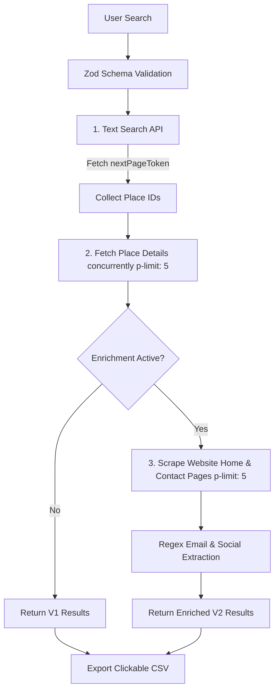

# FreeMapScrapper

**Find Local Businesses. Get Real Leads. Build Opportunities.**

🌐 **Live Website**: [https://free-map-scrapper.vercel.app/](https://free-map-scrapper.vercel.app/)

FreeMapScrapper is a lightweight, open-source Google Maps business export utility. It allows users to search for local businesses by keyword and location, extract real-time contact information, and export leads as a cleanly formatted CSV—complete with clickable Excel hyperlink formulas.

No signups, no onboarding, no dashboard, no subscriptions. Just a fast developer-friendly utility.

---

## 🚀 Key Features

- **Google Places API (New) Integration**: Queries real Google Maps database records using modern Places v1 endpoints.
- **Concurrent Place Details Retrieval**: Uses promise pools to execute Details endpoints in parallel without hitting quota blocks.
- **Free Website Profile Enrichment**: Scrapes business homepages and contact subpages for contact details (Emails, Instagram, Facebook, and WhatsApp links) for free—no paid scrapers or heavy browser instances required.
- **Formattable CSV Exporter**: Generates `.csv` sheets with precompiled Excel `=HYPERLINK` formulas so URLs are clickable.
- **Dynamic SEO Blog**: Pre-rendered dynamic blog subpages (`/blog/[slug]`) configured with static site generators (`generateStaticParams`) and dynamic metadata schemas.
- **Clean Google Workspace Aesthetic**: Standardized Google Maps theme colors featuring neutral card lists, Google Blue primary buttons, and Google Green highlights.

---

## 🛠️ Tech Stack & Dependencies

- **Framework**: [Next.js 15 (App Router)](https://nextjs.org/)
- **Language**: [TypeScript](https://www.typescriptlang.org/)
- **CSS / Styling**: [Tailwind CSS v4](https://tailwindcss.com/) & [Lucide Icons](https://lucide.dev/)
- **HTML Parsing / Scraping**: [Cheerio](https://cheerio.js.org/) (for lightweight homepage parsing)
- **Concurrency Pool**: [p-limit](https://github.com/sindresorhus/p-limit) (manages Details and scraping concurrency)
- **Validation**: [Zod](https://zod.dev/) (safeguards query parameter schema parsing)

---

## ⚙️ How the Pipeline Works

FreeMapScrapper separates the search process into three concurrent pipeline stages:



1. **Text Search Loop**:
   - Compiles search keywords into queries (e.g. `dentist in Indiranagar, Bengaluru`).
   - Recursively resolves page tokens up to the requested result count (limit: 5, 10, 20, 30, 50, 70, 100, or Custom).
2. **Details Fetch Pool**:
   - Queries `https://places.googleapis.com/v1/places/{placeId}` for each business.
   - Restricts concurrent requests to **5** using `p-limit` to prevent request blocks or heavy memory overhead.
3. **Cheerio Scraping & Regular Expression Matching**:
   - If enrichment is toggled on, reads the target website home page.
   - Uses **Cheerio** to load HTML, extracts anchors with `mailto:`, parses href tags for social matches (Facebook, Instagram, WhatsApp).
   - Scans body text with regex to identify emails, filtering out False Positives (like `.png`, `.jpg`, `.js`, etc.).
   - If no emails are found on the homepage, scans for a parsed contact link (e.g., `/contact-us`, `/about`) and scrapes that subpage as a secondary fallback.

---

## 💻 Local Setup

### Prerequisite: Google Cloud Setup
1. Enable the **Places API (New)** in your [Google Cloud Console](https://console.cloud.google.com/).
2. Generate an API Key under **Credentials**.
3. Create a `.env.local` file in the root directory:
   ```env
   GOOGLE_MAPS_API_KEY=your_google_maps_api_key_here
   ```

### Running Locally
1. Install dependencies:
   ```bash
   npm install
   ```
2. Start the hot-reload Next.js dev server:
   ```bash
   npm run dev
   ```
3. Open [http://localhost:3000](http://localhost:3000) in your browser.

---

## 🤝 Contributing

Contributions are welcome! Please follow these guidelines:
1. Fork this repository.
2. Create a branch (`feature/your-feature-name`).
3. Maintain TypeScript interfaces and enforce strict validation models in Zod.
4. Ensure all changes are backward-compatible (if enrichment is off, the app must run exactly as V1).
5. Compile and test the build before submitting a Pull Request:
   ```bash
   npm run build
   ```

---

## 👥 Connect with the Founder

FreeMapScrapper is built and maintained by **Devansh Singh**. If you have ideas, feedback, or want to contribute to the roadmap, connect with the founder!

- **LinkedIn**: [Devansh Singh](https://www.linkedin.com/in/devanshsingh2006/)
- **GitHub**: [@Devansh1974](https://github.com/Devansh1974)
- **Email**: [devanshsingh2006@gmail.com](mailto:devanshsingh2006@gmail.com)

---

**Find businesses. Get contacts. Build opportunities.**
